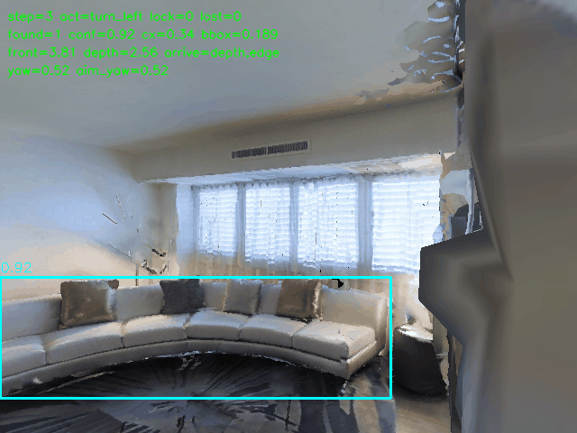
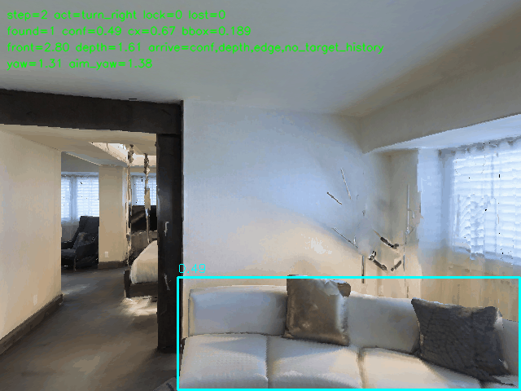
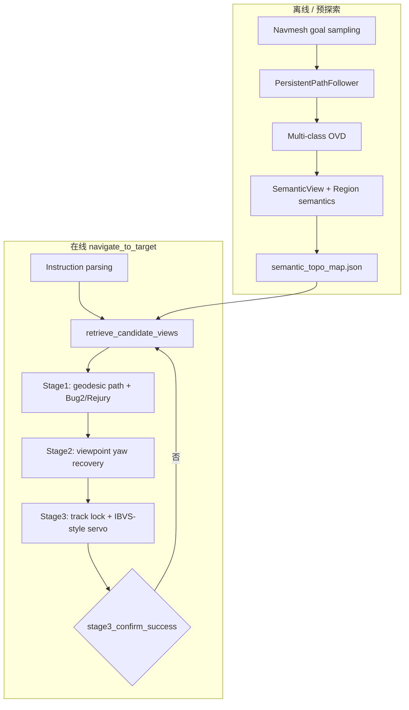

# 室内语义导航（HM3D / Habitat-Sim）

在 Habitat-Matterport3D 室内仿真中，依据自然语言指令驱动 embodied agent 导航至目标物体邻域。感知栈为 RGB-D；目标检测采用 GroundingDINO 开放词汇检测（OVD）；全局记忆为语义拓扑图 SemanticTopoMap；运动层为 navmesh 测地路径规划 + 分阶段视觉伺服（visual servoing）。

开发工具：Vibe Coding — Cursor；讨论与方案梳理 — ChatGPT、Claude。

---

## 演示

| 沙发 (sofa) | 椅子 (chair) |
|:---:|:---:|
|  |  |

更多导航与系统探索过程见 `result/`、`pre_explore.gif`、`systematic_explore.gif`。

---

## 1. 任务定义

| 项目 | 说明 |
|------|------|
| 场景 | MP3D `17DRP5sb8fy`，经 scene dataset 配置加载附带的 navigation mesh |
| 指令 | 中文经 DashScope 解析为五类目标类别 |
| OVD 文本提示 | sofa / bed / chair seat / door / table |
| 成功判据 | 无 GT 位姿；Stage3 分级到达 + `stage3_confirm_success` 闸门；结合 GIF 与 navigation log 人工验证 |
| 主实现 | `embodied_agent_top_debug.py`|
| 基线 | `embodied_agent_2.py`（ShortestPath + 任务内 anchor 估计，无 SemanticView 库） |

---

## 2. 系统架构



设计要点：将 global placement（metric）与 local alignment（visual）解耦——Stage1 完成 geodesic 区域逼近；Stage2 恢复观测位姿中的 yaw 自由度；Stage3 在局部闭环执行 detection-based visual servoing，避免仅依赖路径终点位姿。


---

## 3. 感知栈

### 3.1 GroundingDINO（OVD）

直接采用第三方 [GroundingDINO](https://github.com/IDEA-Research/GroundingDINO)（开放词汇检测，OVD）官方预训练权重。

本项目的接入方式（`TargetDetector`）：

- 按导航目标构造英文文本提示，对 RGB 帧调用 `predict` 得到候选框与置信度；
- 将模型输出的框格式转为角点坐标，再经本项目定义的 `SHAPE_PRIORS` 做几何过滤，取通过过滤的最高分框；


### 3.2 形状先验（SHAPE_PRIORS）

对每类目标约束包围框面积占比与宽高比区间，剔除整墙、远景噪点等与类别几何不符的候选。门侧重竖长结构；沙发、床侧重横向延展。区间定义见源码 `SHAPE_PRIORS`。

### 3.3 深度融合（Stage3）

- bbox 深度：检测 ROI 内深度统计（偏低分位），减轻背景墙拉远。
- 三向探针：左 / 前 / 右扇区深度，用于障碍与开阔走廊判别。
- 融合策略：compact 类或小框实例将 bbox 深度与前方探针取保守合并；大件以 bbox 深度为主。实现见 `_det_depth_stage3`。

### 3.4 拮抗类消歧（bed ↔ sofa）

`detect_target_disambiguated` 对冲突标签组（`LABEL_CONFLICT_GROUPS`）执行双通道 OVD。找床时若沙发通道在置信度、语义权重（置信度与框尺度联合）或形状上占优，则否决本帧 bed 检测。否决原因写入日志 `[disambig]`。倍率与间隙等超参见 `STAGE3_BED_DISAMBIG_*` 常量。

---

## 4. 语义拓扑建图（SemanticTopoMap）

### 4.1 数据结构

- SemanticView：一次有效观测，含世界系站位、机体 yaw、检测置信度、bbox 占比、目标相对偏角、所属 region、时间戳及失败计数；`target_rel_angle` 供 Stage2 恢复 bearing。
- Region grid：平面栅格化区域语义，带访问时间与指数衰减，降低陈旧观测权重。
- Local anchors / frontier：探索期登记门口、走廊等结构，辅助 region 级语义。

### 4.2 系统探索（systematic_explore）

1. 在 navmesh 上采样目标点；
2. PersistentPathFollower 至各点，沿途周期性多类检测并写入 region；
3. 到达后 multi-yaw 环视，实例化 SemanticView；
4. 近距同向观测做 spatial merge；
5. 同位姿 bed/sofa 冲突时按竞争 margin 标记 confounded，后续检索剔除；
6. 序列化为 `semantic_topo_map.json`。

### 4.3 候选检索（retrieve_candidate_views）

对每个 SemanticView 计算导航效用分数：综合语义衰减后的置信度、历史 bbox 质量、局部重访惩罚、以及到当前位姿的测地（或直线）距离惩罚；失败次数计入负项。按分数 Top-K 选取并做空间去重。无可用 view 时 fallback 至 region prototype 中心。打分项权重见 `view_nav_score` 与相关 `NAV_*` 常量。

---

## 5. 三阶段导航

入口：`navigate_to_target`。每个候选 SemanticView 分配独立步数预算；失败则 `mark_view_failed` 并切换下一候选。

### 5.1 Stage1 — metric coarse navigation

目标：进入该 view 对应位姿的 geodesic 邻域，或满足 open-area 条件时提前结束；不要求当前帧检出目标。

PersistentPathFollower / `run_persistent_path_follow`：

- 基于 Habitat ShortestPath 的 waypoint 跟踪，支持 persistent path 局部重规划；
- heading fusion：远距沿路径切向 / bearing，近距提高 saved view 语义朝向权重；
- `path_follow_steering_action` 按航向误差在 turn / forward 间切换。

Bug2-style wall following（Stage1LocomotionState）：

- 有限状态机覆盖正常跟线、贴墙 escape、墙角与 recovery 转向；
- escape 阶段采用 burst commitment，抑制左右决策振荡；
- 由近障、stuck 计数、goal stall 等触发。

Stage1Coordinator 在 GOAL_SEEK、FOLLOW_WALL、MLINE_TRANSIT、doorway_transit 等模式间切换。

Rejury（`llm_judge.py`）：贴墙模式下基于三向深度与墙 hit 几何的规则闸门（visible、reachable、doorway_seek、past_doorway、reacquire 等），用于区分真实门口与开阔区域；非端到端神经网络策略。

### 5.2 Stage2 — viewpoint recovery

依据 SemanticView 保存的机体 yaw 与 `target_rel_angle` 合成目标视线方位，`recover_view_direction` 仅通过 in-place 旋转将当前 yaw 对齐至该方位（容差见 `STAGE2_VIEW_YAW_TOL`）。平移由 Stage1 完成。

### 5.3 Stage3 — visual servoing & arrival

感知-动作环路：消歧检测 → `Stage3TrackState` 更新 → 丢检迟滞得到 `effective_det`（含 synthetic hold）。

Track lock 有限状态机：连续帧满足置信度与 bbox 约束后进入 locked；compact 与 bed 支持高置信快速锁定；门附加宽高比闸门；锁定后对大幅跳变的低置信框做滤波（`stage3_filter_locked_det`）。

动作调度：若分级到达已满足且无需继续逼近则 hold；否则优先 `visual_servo_locked_approach`（对准后前进）；再退化至 scan。RecoveryState 在已锁定或目标可见时清除，避免与伺服竞争。

床类目标额外要求前方探针与融合深度一致时才允许停止逼近，缓解走廊远景误检导致的 premature hold。

分级到达采用多 tier（如 depth_near、bulky_locked、edge 系列），由 `near_arrival_check_stage3` 按目标几何类别（compact / bulky）选用；`stage3_confirm_success` 在 streak、最小前进步数、合成帧剔除及床/门专用条件上施加最终闸门。

---

## 6. 基线：`embodied_agent_2.py`

| 模块 | 方法 |
|------|------|
| Anchor | 旋转扫描 + `estimate_target_nav_point`（射线与深度反投影，navmesh snap） |
| Global plan | 单次 ShortestPath |
| Follow | `path_follow_steering_action`；waypoint stuck 时 depth probe 局部绕行 |
| Fine approach | detection-driven IBVS；连续帧到达判定 |
| Memory | KNOWN_PLACES 记录每类少量成功位姿 |

无 SemanticView 多候选、无 Stage2 相对偏角恢复、无 bed/sofa 双通道消歧。

---

## 7. 方案对比与效果（定性）

| 维度 | Top (debug/final) | Baseline (v2) |
|------|-------------------|---------------|
| 全局表示 | SemanticTopoMap | KnownPlace / 无 |
| 规划 | persistent path + geodesic view ranking | 单次 ShortestPath |
| 局部控制 | 3-stage + track lock | scan + fine approach |
| 绕障 | Bug2 + Rejury | depth probe |
| sofa / chair | 多数可达 | sofa 尚可，chair 不稳定 |
| bed / door | 消歧与 arrival 策略迭代中 | 误检率相对更高 |

尚无统一 success rate / SPL 类自动基准。

---

## 8. 仓库

```
embodied_agent_top_debug.py
embodied_agent_2.py
llm_judge.py
semantic_topo_map.json
result/                         # 导航演示 GIF
web/
├── app.py                      # FastAPI 后端
├── static/                     # 前端 (index.html / app.js / style.css)
└── script/
    ├── start_web.py            # Web 启动入口
    ├── run_web.sh
    ├── check_web_deps.py
    └── requirements-web.txt
```

依赖：HM3D、GroundingDINO 权重、habitat conda 环境；场景与权重路径见各脚本配置项。

---

## 9. 风险点讨论

以下为当前 pipeline 的主要失效模式与工程风险，按模块归纳；与 §7 定性效果相互印证，便于实验设计与日志排查。

### 9.1 感知与 OVD

| 风险 | 表现 | 影响阶段 |
|------|------|----------|
| 开放词汇误检 | 沙发激活 bed 提示、壁画/大开口激活 door、浴室小物体激活 bed | 建图写入错误 SemanticView；Stage3 错误锁定或假到达 |
| 第三方检测器域差 | GroundingDINO 非本场景微调，置信度与框尺度分布不可控 | 全链路；阈值调参仅缓解、难根除 |
| 单帧最高分策略 | 每帧只保留一个 bbox，多实例或遮挡时易跟错目标 | Stage3 对准与到达 |

床 / 沙发、门 / 壁画为当前最高频混淆对；消歧与形状先验可降低概率，无法保证消除。

### 9.2 语义拓扑建图

| 风险 | 表现 | 影响 |
|------|------|------|
| 同位姿双标签 | 探索时同一机位并存 bed 与 sofa 的 SemanticView | 检索到错误候选，Stage1 走向错误区域 |
| 地图陈旧 | 场景布局不变但语义衰减或失败计数未刷新 | 高分 view 实际不可复现 |
| 探索覆盖不足 | 采样未达目标所在房间 | 无 view 时 fallback region 中心，粗导航偏差大 |
| 错误观测固化 | 误检一旦 merge 进 topo | 后续多候选重试仍从错误先验出发 |

强依赖预探索质量：未建图或 JSON 与当前场景/出生点不匹配时，主方案相对基线优势减弱。

### 9.3 Stage1（metric）

| 风险 | 表现 | 影响 |
|------|------|------|
| 未进邻域 | 路径绕障、岛台、走廊几何导致耗尽 per-view 预算 | 无法进入 Stage2/3 |
| 贴墙振荡 | Bug2 escape 与 path following 切换频繁 | 步数浪费、轨迹偏离 aim 区域 |
| 门口规则误判 | Rejury 将开阔区域判为 doorway 或反之 | U 型空间绕岛台、错过正确出口 |
| 区域原型偏差 | 无 SemanticView 时仅用 region 中心 | 终点与真实观测位姿不一致 |

Stage1 失败时若开启复位（`NAV_RESET_ON_S1_FAIL`），结果还受出生点与复位策略影响。

### 9.4 Stage2 / Stage3（visual）

| 风险 | 表现 | 影响 |
|------|------|------|
| 视点恢复不足 | 邻域内但 yaw 未对齐，目标不在视场 | Stage3 长时间 scan / recovery |
| 早停 hold | bulky 到达 tier 在仍偏远时满足，agent 停止前进 | 床、沙发常见；已用 depth–front 一致性等闸门抑制 |
| 开放前方假到达 | 融合深度近但前方探针远（走廊） | 床导航易触发；日志可见 `success_blocked_bed_open_front` |
| 锁定后跳框 | 双检测交替导致 turn 振荡 | 难收敛到到达 |
| 丢检迟滞 | synthetic 帧延续错误 bbox | 对墙或侧向误检时持续错误动作 |
| Recovery 与伺服竞争 | 卡住时 hard_turn 把目标甩出视场 | 椅、床在 scan 后恢复期易出现 |

Stage3 为闭环段，OVD 单帧错误会被放大为错误动作序列。

### 9.5 基线方案特有风险（`embodied_agent_2.py`）

- 单次扫描估点：锚点错误则 ShortestPath 全局失败，无多 view 重试。
- KNOWN_PLACES 污染：一次错误成功写入后，后续任务重复走向错误区域。
- 到达判据相对宽松，易在错误物体前满足 streak。

### 9.6 评测与部署

| 风险 | 说明 |
|------|------|
| 无自动 GT 指标 | 成功率、SPL、目标距离等未统一报告，跨实验可比性弱 |
| 出生点敏感 | 门厅、走廊等 spawn 会显著改变可达性与检测可见性 |
| 算力与内存 | GroundingDINO + Habitat 同进程加载，Web  eager init 易 OOM 或进程被 kill |
| 外部依赖 | DashScope 指令解析、HuggingFace BERT 权重、代理环境配置不当会导致启动失败 |
| 日志/GIF 体积 | debug 版长时间导航产生大文件，不利于批量回归 |

调参建议：结合 `navigation_log_*.txt` 中 `[servo]`、`[ARRIVE]`、`[disambig]`、`success_blocked_*` 对照 `embodied_agent_top_debug.py` 与 `llm_judge.py` 常量区迭代，而非仅改单点阈值。

---

## 10. 后续工作

- bed：bed/sofa 消歧、open-front 假到达、confounded view 过滤。
- door：门框几何与壁画/大开口区分、aim_yaw 稳定性。
- 困难出生点（如门厅）：固定 spawn 与复位策略对比实验。
- 评测：固定 spawn 与随机种子、引入 GT 距离或成功率指标。

---

## 11. 引用与许可

Habitat-Sim / HM3D、GroundingDINO：遵循各自许可证。本项目仅供研究实验。
